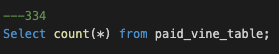
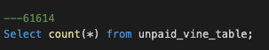
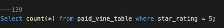
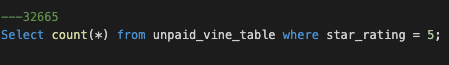

# Amazon_Vine_Analysis

## Overview of the analysis
The purpose of this analysis is to analyze Amazon reviews written by members of the paid Amazon Vine program. The Amazon Vine program is a service that allows manufacturers and publishers to receive reviews for their products. Companies like SellBy pay a small fee to Amazon and provide products to Amazon Vine members, who are then required to publish a review.

## Results
### Vine Reviews

The query above shows that there is a total of 334 vine reviews.

### Non-Vine Reviews

The query above shows that there is a total of 61,614 non-vine reviews.

### Vine 5 Star Reviews

Of 334 vine reviews, 139 are 5-star reviews.

### Non-Vine 5 Start Reviews

Of 61,614 non-vine reviews 32,665 are 5 star reviews.

#### Vine Reviews 5 Star Percentage
(139/334) x 100 = 42%

#### Non-Vine Reviews 5 Star Percentage
(32,665/61,614) x 100 = 53%

## Summary
From the data above we were able to find that there is no positivity bias for reviews in the Vine program. When calculating the vine reviews percentage we found that 42% of the total vine reviews are 5 stars. While calculating the percentage of the non-vine reviews we found that 53% of the total non-vine reviews are 5 stars. There is enough information in this dataset to state there is no positivity bias for reviews in the Vine program.

Also, an additional set of analysis that can be done to confirm there is no positivity bias for review in the Vine program, would be to run the same analysis for their entire Amazon US Reviews Dataset. The dataset I chose may happen to have a lower vine review 5-star percentage. To clearly define if the Vine program has a positivity bias for reviews all datasets need to be analyzed. By doing this analysis all data regarding the Vine program is analyzed and then we can identify if a positive bias for reviews in the Vine program exists.
